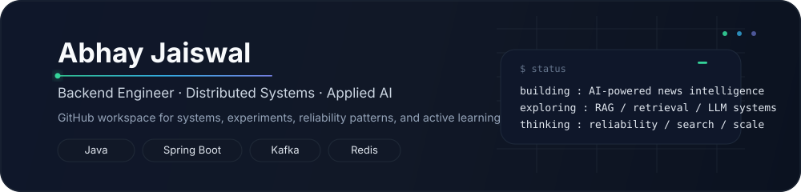

<div align="center">



<br/>

[](https://abhay-portfolioo.netlify.app/)
[](https://github.com/Abhay123abhi?tab=repositories)

</div>

## Engineering focus

```text
backend     : APIs · microservices · event-driven architecture
systems     : system design · reliability · observability · scale
applied AI  : RAG · retrieval · vector search · LLM integration
learning    : distributed systems internals · performance · AI engineering
```

## What I work on

<table>
<tr>
<td width="50%" valign="top">

### Backend & distributed systems

Production-minded services, event-driven workflows, caching, concurrency, data access, failure handling, observability, and performance.

</td>
<td width="50%" valign="top">

### Applied AI & exploration

Embeddings, RAG, vector retrieval, search, and LLM-backed capabilities integrated into reliable backend systems.

</td>
</tr>
</table>

## Toolbox

**Backend** — `Java` · `Spring Boot` · `Spring Security` · `REST` · `Microservices`

**Data & messaging** — `Kafka` · `Redis` · `PostgreSQL` · `MySQL` · `OpenSearch`

**Platform & reliability** — `Docker` · `Kubernetes` · `AWS` · `Prometheus` · `Grafana`

**Frontend** — `React` · `Ionic`

## Engineering mindset

`design for failure` · `measure before optimizing` · `keep boundaries clear` · `make AI grounded and observable`

---

<sub>For the polished career view, project walkthroughs, and experience details → <a href="https://abhay-portfolioo.netlify.app/">portfolio</a>.</sub>
