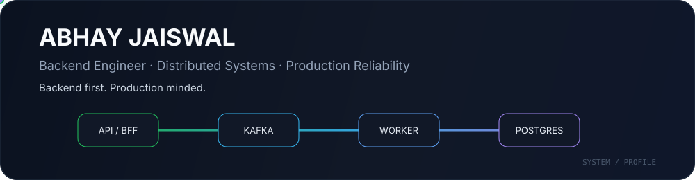

<div align="center">



<br/>

[](https://abhay-portfolioo.netlify.app/)
[](https://github.com/Abhay123abhi)

</div>

---

## About

Backend-heavy software engineer with **4+ years of production experience**, building scalable APIs, event-driven workflows, reliable data paths, and production-ready delivery pipelines.

I work mainly with **Java, Spring Boot, Kafka, Redis, PostgreSQL, Docker, Kubernetes, and React**, with a strong focus on distributed systems, observability, reliability, and performance.

<table>
<tr>
<td align="center"><b>4+ years</b><br/>production software</td>
<td align="center"><b>1K+</b><br/>business events / day</td>
<td align="center"><b>25%</b><br/>faster deployment cycles</td>
<td align="center"><b>60%</b><br/>less manual effort</td>
</tr>
</table>

## Engineering stack

<table>
<tr>
<td valign="top" width="50%">

### Backend
`Java 8–21` · `Spring Boot` · `Spring Security` · `JPA` · `Hibernate` · `REST APIs` · `BFF`

### Distributed systems
`Kafka` · `Redis` · `Transactional Outbox` · `Idempotency` · `Retry / DLQ` · `Eventual Consistency`

</td>
<td valign="top" width="50%">

### Data
`PostgreSQL` · `MySQL` · `MongoDB` · `Indexing` · `Query Optimization`

### Delivery & reliability
`Docker` · `Kubernetes` · `Jenkins` · `Prometheus` · `Grafana` · `Loki` · `Tempo` · `Splunk`

</td>
</tr>
</table>

## Selected systems

| Project | Engineering focus | Core stack |
|---|---|---|
| **[Event-Driven Incident Observability](https://github.com/Abhay123abhi/event-driven-incident-observability)** | Incident investigation, transactional outbox, retries, alert deduplication, persistence, retention, metrics/logs/traces | Java · Spring Boot · Kafka · PostgreSQL · Prometheus · Loki · Tempo · Grafana |
| **[AI-Powered News Intelligence](https://github.com/Abhay123abhi/ai-powered-news-intelligence)** | Multi-source aggregation, parallel provider calls, Redis caching, AI summaries, article Q&A, cross-publisher comparison | Java 21 · Spring Boot · Redis · React · Gemini |
| **[Chat App](https://github.com/Abhay123abhi/chat-app)** | Real-time messaging and containerized full-stack delivery | React · Node.js · MongoDB · Docker |
| **[Personal Portfolio](https://github.com/Abhay123abhi/personal-portfolio)** | Engineering-focused portfolio with a system-design-inspired interface | React · Vite · Netlify |

## How I think about systems

```text
Request
   │
   ▼
API / BFF ─────► Cache
   │
   ├───────────► Kafka ─────► Workers
   │                           │
   ▼                           ▼
Database                 External systems
   │                           │
   └──── metrics · logs · traces ────► Observability
```

I care about what happens beyond the happy path: retries, duplicate events, partial failures, timeouts, backpressure, idempotency, deployment safety, and debuggability in production.

## Current focus

`Distributed Systems` · `System Design` · `Search` · `AI Engineering` · `RAG` · `Production Reliability`

Going deeper into retrieval quality, LLM-backed applications, intelligent search, scalable system design, and reliability patterns that hold up under real production failure modes.

## GitHub activity

<div align="center">


</div>

---

<div align="center">

### Build systems that stay reliable when things stop being ideal.

**Backend Engineering · Distributed Systems · Applied AI · Gurugram, India**

</div>
