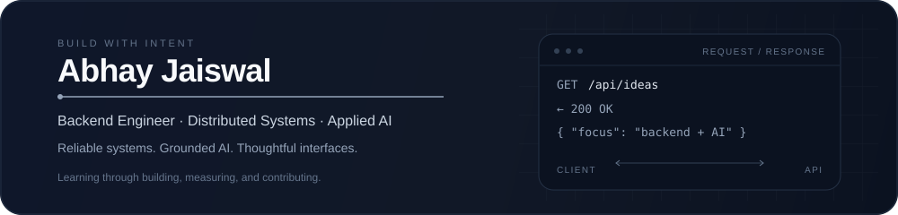

<div align="center">



<br/>

[](https://abhay-portfolioo.netlify.app/)
[](https://github.com/Abhay123abhi?tab=repositories)
[](https://github.com/pulls?q=is%3Apr+author%3AAbhay123abhi+-user%3AAbhay123abhi)

</div>

## `/focus` · Engineering focus

```text
backend     : APIs · microservices · event-driven architecture
systems     : system design · reliability · observability · scale
applied AI  : RAG · retrieval · vector search · LLM integration
learning    : distributed systems internals · performance · AI engineering
```

## `/work` · What I work on

<table>
<tr>
<td width="50%" valign="top">

### ⚡ Backend & distributed systems

Reliable APIs and event-driven workflows, with clear boundaries, caching, concurrency, failure handling, and observability.

</td>
<td width="50%" valign="top">

### ✦ Applied AI & retrieval

RAG, embeddings, vector search, and LLM integrations—with grounded responses and AI kept independent of core workflows.

</td>
</tr>
</table>

## `/stack` · Toolbox

**Backend** — `Java` · `Spring Boot` · `Spring Security` · `JPA / Hibernate` · `REST`

**Applied AI** — `Gemini` · `RAG` · `Embeddings` · `pgvector` · `Structured output`

**Data & messaging** — `Kafka` · `Redis` · `PostgreSQL` · `MySQL` · `MongoDB`

**Platform & observability** — `Docker` · `AWS` · `Jenkins` · `Prometheus` · `Grafana` · `Loki` · `Tempo`

**Frontend** — `React` · `JavaScript` · `Ionic` · `WebSocket / STOMP`

## `/principles` · Engineering mindset

`design for failure` · `measure before optimizing` · `keep boundaries clear` · `ground AI in evidence`

---

<sub>Experience and project walkthroughs → <a href="https://abhay-portfolioo.netlify.app/">portfolio</a> · Code and architecture → <a href="https://github.com/Abhay123abhi?tab=repositories">repositories</a> · Open-source work → <a href="https://github.com/darrien1998/dsh-ditto/pull/12">merged contribution</a>.</sub>
